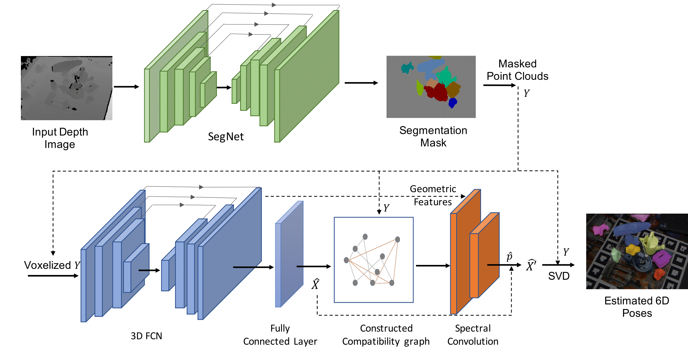

# 6D Object Pose Estimation with Pairwise Compatible Geometric Features 


## Table of Content
- [Overview](#overview)
- [Getting Started](#GettingStarted)
- [Datasets](#datasets)
- [Training](#training)
- [Evaluation](#evaluation)
    - [Evaluation on LineMOD Dataset](#evaluation-on-linemod-dataset)
    - [Evaluation on LineMOD Occlusion Dataset](#evaluation-on-linemod-occlusion-dataset)
- [Citation](#citation)

## Overview
This work addresses the problem of 6-DoF pose estimation under heavy occlusion. We propose an end-to-end deep neural network model recovering object poses from depth measurements. The proposed model enforces pairwise consistency of 3D geometric features by applying spectral convolutions on a pairwise compatibility graph. 


> [6D Object Pose Estimation with Pairwise Compatible Geometric Features](https://dspace.mit.edu/bitstream/handle/1721.1/138123/ICRA2021PoseEstimation.pdf?sequence=1&isAllowed=y)  
> Muyuan Lin, Varun Murali, and Sertac Karaman 


## Getting Started

### Prerequisites 
- Tested on Ubuntu 16.04, GeForce GTX 1080, NVIDIA-SMI 410.129

### Installation
- Clone this repo:
```bash
git clone --recursive https://github.com/mit-aera/DeepPCGF 
```

- Install Python 3.7+, [PyTorch](http://pytorch.org and) 1.4 and other dependencies (e.g., torchvision).
  - For Conda users, you can create a new Conda environment using `conda env create -f environment.yml`.

- Install [MinkowskiEngine](https://github.com/StanfordVL/MinkowskiEngine)
```
(Make sure you follow installation instructions in the commit e2cfe490 of MinkowskiEngine)
git clone https://github.com/StanfordVL/MinkowskiEngine
cd MinkowskiEngine 
git checkout e2cfe490ee5edb078e8fedd9766609daf2d5129a
conda activate pcgf
python setup.py install
```

- Download [pretrained models](https://drive.google.com/drive/folders/1Brgr4Nc3JBt8mSSqIqvS90rQkfi9A1Zt?usp=sharing), unzip the directory and move 'LineMOD' and 'OcclusionLineMOD' folders under '../checkpoints'.


## Datasets
- Download [preprocessed LineMOD dataset](https://drive.google.com/file/d/1YFUra533pxS_IHsb9tB87lLoxbcHYXt8/view?usp=sharing)

- Download [Occlusion LineMOD Dataset](https://cloudstore.zih.tu-dresden.de/index.php/s/a65ec05fedd4890ae8ced82dfcf92ad8/download)

- The two datasets are assumed to be placed under "../data/" by default.

## Training
```bash
conda activate pcgf
python train.py --name LineMOD \
  --model pcgf \
  --image_based true \
  --dataset LineMOD \
  --data_path ../data/Linemod_preprocessed \
  --voxel_size 0.003  \
  --geometric_check gcn \
  --gpu_ids 0 \
  --mu 100
```

## Evaluation
Evaluation on LineMOD dataset:
```bash
conda activate pcgf 
python test.py --name LineMOD \
  --model pcgf \
  --image_based true \
  --dataset LineMOD \
  --data_path ../data/Linemod_preprocessed \
  --voxel_size 0.003  \
  --geometric_check gcn \
  --gpu_ids 0 \
  --select_pts 50 
```

Evaluation on Occlusion LineMOD dataset:
```bash
conda activate pcgf 
python test.py --name OcclusionLineMOD \
  --model pcgf \
  --image_based true \
  --dataset LineMODOcclusion \
  --data_path ../data/Linemod_occlusion \
  --voxel_size 0.003  \
  --geometric_check gcn \
  --gpu_ids 0 \
  --select_pts 50 
```

## Citation
If you use this code for your research, please cite our paper.
```
@inproceedings{lin20216d,
  title={6D Object Pose Estimation with Pairwise Compatible Geometric Features},
  author={Lin, Muyuan and Murali, Varun and Karaman, Sertac},
  booktitle={2021 IEEE International Conference on Robotics and Automation (ICRA)},
  pages={10966--10973},
  year={2021},
  organization={IEEE}
}
```
